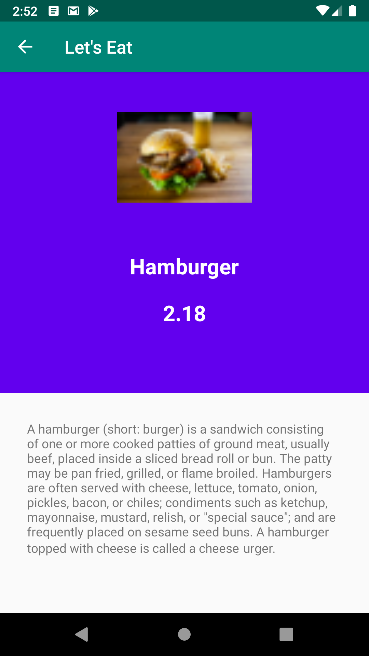
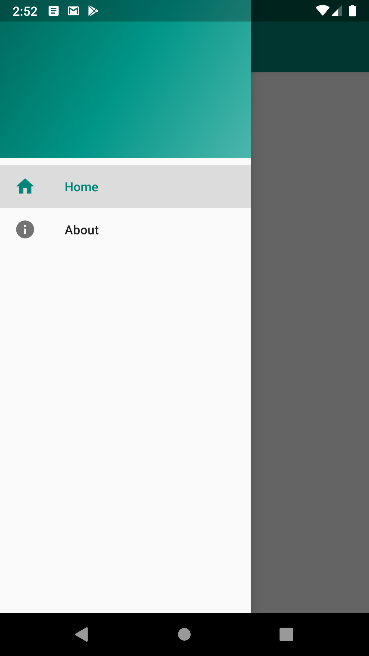

# Let's Eat

A submission for [Belajar Membuat Aplikasi Android untuk Pemula](https://www.dicoding.com/academies/51) written in Kotlin.

With the given task, I learned about Activity, View Binding, JSON Deserializing, and Navigation using drawer

## Screenshot

## License

Licensed under [MIT licensed](LICENSE)
